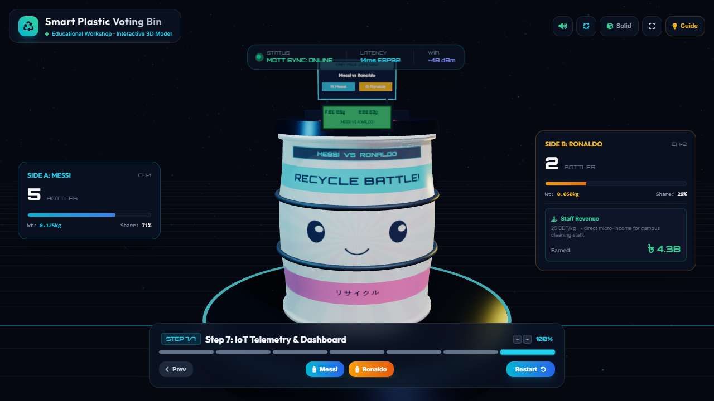
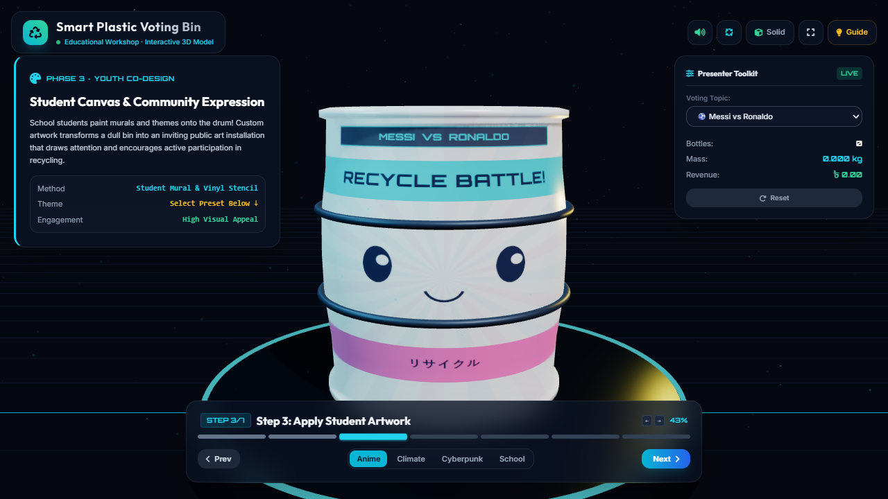
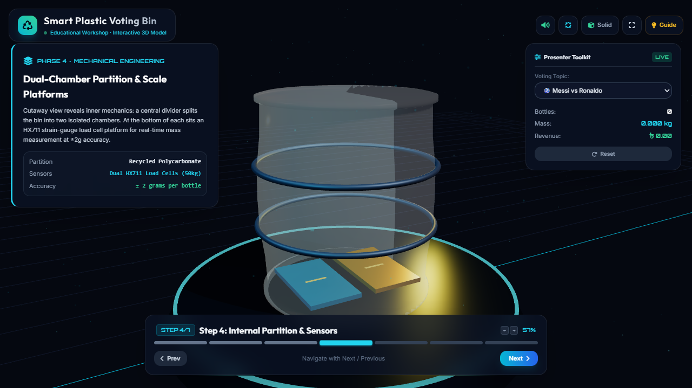
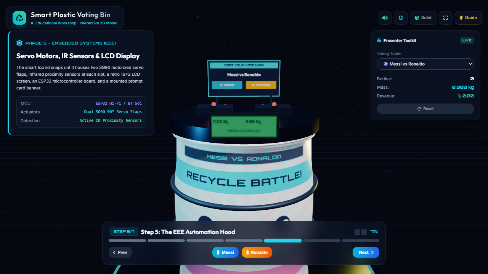

# Smart Plastic Voting Bin

An interactive 3D presentation of an upcycled recycling bin where throwing away a plastic bottle counts as a vote.

**[Live demo](https://sandipkumarpaul.github.io/smart_artistic_voting_bin/)** · [Jump straight to the voting demo](https://sandipkumarpaul.github.io/smart_artistic_voting_bin/#step=6) · [Early prototype](https://sandipkumarpaul.github.io/smart_artistic_voting_bin/prototype.html)



## The idea

A discarded 200 L HDPE drum is cleaned, primed and painted by students, then split inside into two chambers. A card on the lid asks a light-hearted question (*Messi or Ronaldo? Tea or coffee?*), and each answer gets its own slot. People vote by dropping a plastic bottle into the slot they agree with.

Sensors in the lid and base detect and weigh every bottle, an LCD on the bin shows the running tally, and the counts are sent over Wi-Fi to a dashboard. The collected plastic is sold as scrap and the money goes to the campus cleaning staff.

This repository contains the browser-based 3D walkthrough used to present the concept at a workshop. It visualizes the design; it does not include firmware.

## Walkthrough

| Step | What it shows |
| --- | --- |
| 1. Raw drum | The discarded HDPE drum, with a procedurally scratched plastic texture |
| 2. Prime & paint | An animated paint wipe from raw plastic to matte white primer |
| 3. Student artwork | Four switchable mural designs: Anime, Climate, Cyberpunk and School |
| 4. Partition & sensors | A see-through view of the central divider and the two load-cell platforms |
| 5. Automation hood | The lid: servo flaps, IR sensors, a 16×2 LCD, the ESP32 board and the question card |
| 6. Voting demo | Cast votes and watch the IR LED flash, the flap open, a bottle drop in and the LCD update |
| 7. IoT dashboard | Live vote share, weight per side and the revenue earned for the cleaning staff |

| Student artwork (step 3) | Internals (step 4) | Automation hood (step 5) |
| --- | --- | --- |
|  |  |  |

## Features

- **Procedural 3D scene.** The drum, bottles, lid hardware and every texture (drum art, LCD, question card) are generated in code. There are no model or texture files.
- **Custom questions.** Type your own "A vs B" topic in the Presenter Toolkit, and the drum art, LCD, card and vote buttons all update.
- **Presenter tools.** Auto-rotate, a solid/X-ray toggle, fullscreen, a workshop guide with talking points, and sound effects synthesized with the Web Audio API.
- **Linkable steps.** Each step has its own URL (`#step=1` to `#step=7`), so a link can open the presentation at any point.
- **Mobile-friendly.** The layout adapts to phones, and the camera pulls back on portrait screens so the bin stays in frame.

## Controls

| Input | Action |
| --- | --- |
| <kbd>→</kbd> / <kbd>PageDown</kbd> | Next step |
| <kbd>←</kbd> / <kbd>PageUp</kbd> | Previous step |
| <kbd>1</kbd>–<kbd>7</kbd> | Jump to a step |
| <kbd>F</kbd> | Toggle fullscreen |
| <kbd>Esc</kbd> | Close the workshop guide |
| <kbd>Enter</kbd> / <kbd>Space</kbd> | Start from the welcome screen |
| Drag · scroll · pinch | Orbit and zoom the 3D view |

## Concept hardware

| Part | Role |
| --- | --- |
| ESP32 | Microcontroller; publishes counts and weights over Wi-Fi (MQTT) |
| 2 × load cell + HX711 amplifier | Weighs the plastic in each chamber |
| 2 × IR proximity sensor | Detects a bottle entering each slot |
| 2 × SG90 servo | Opens and closes each slot flap |
| 16×2 LCD | Shows the live tally on the bin |

The simulation's numbers are illustrative: 25 g per bottle (a typical empty 1–1.5 L PET bottle) and 25 BDT per kg of PET scrap.

## Tech stack

- [Three.js](https://threejs.org/) r128 with OrbitControls for the 3D scene
- [GSAP](https://gsap.com/) for camera moves and mechanical animations
- [Tailwind CSS](https://tailwindcss.com/) (Play CDN) for the interface
- Canvas 2D for the procedural textures, the Web Audio API for sound, and [canvas-confetti](https://github.com/catdad/canvas-confetti) for vote milestones
- Plain HTML and JavaScript, with no build step

## Run locally

Everything is in `index.html`. The libraries load from CDNs, so you need an internet connection.

```bash
git clone https://github.com/sandipkumarpaul/smart_artistic_voting_bin.git
cd smart_artistic_voting_bin
python -m http.server 8000
```

Then open <http://localhost:8000>. Opening `index.html` directly in a browser works too.

## Project structure

```
index.html          The presentation (scene, UI and logic in one file)
prototype.html      First iteration: a simpler concept visualizer with the same 7 steps
docs/screenshots/   Images used in this README
```
